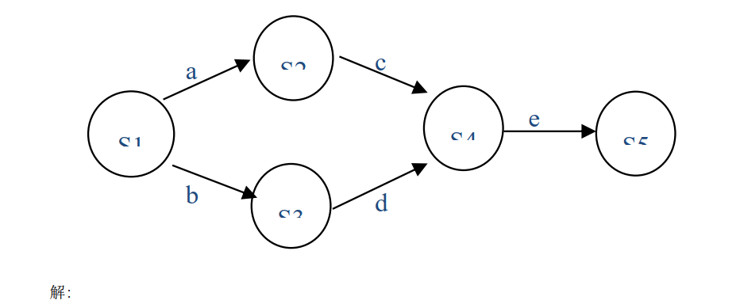
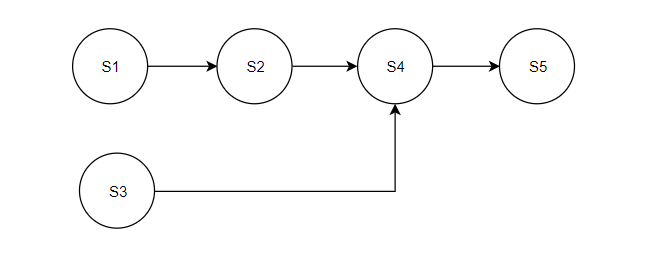
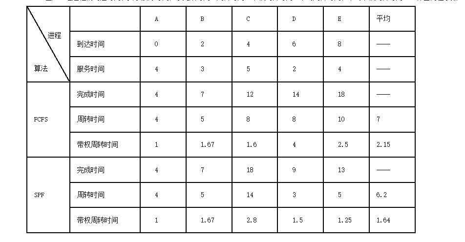
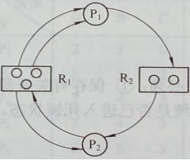
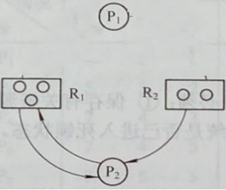
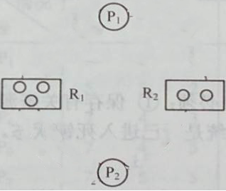
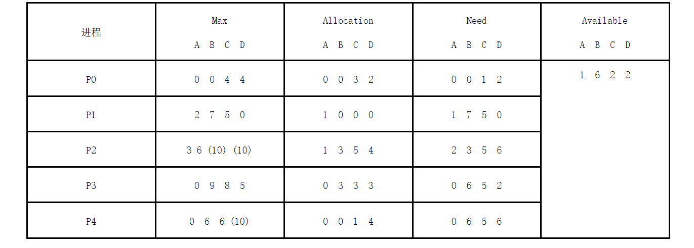
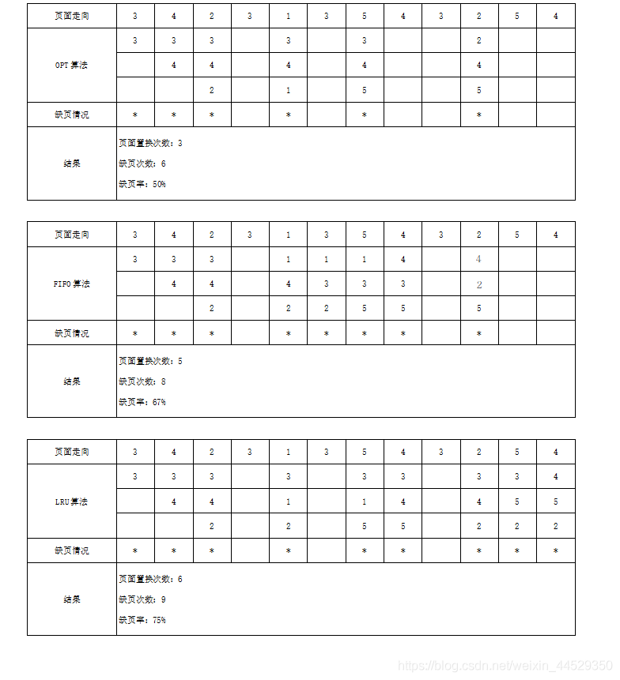
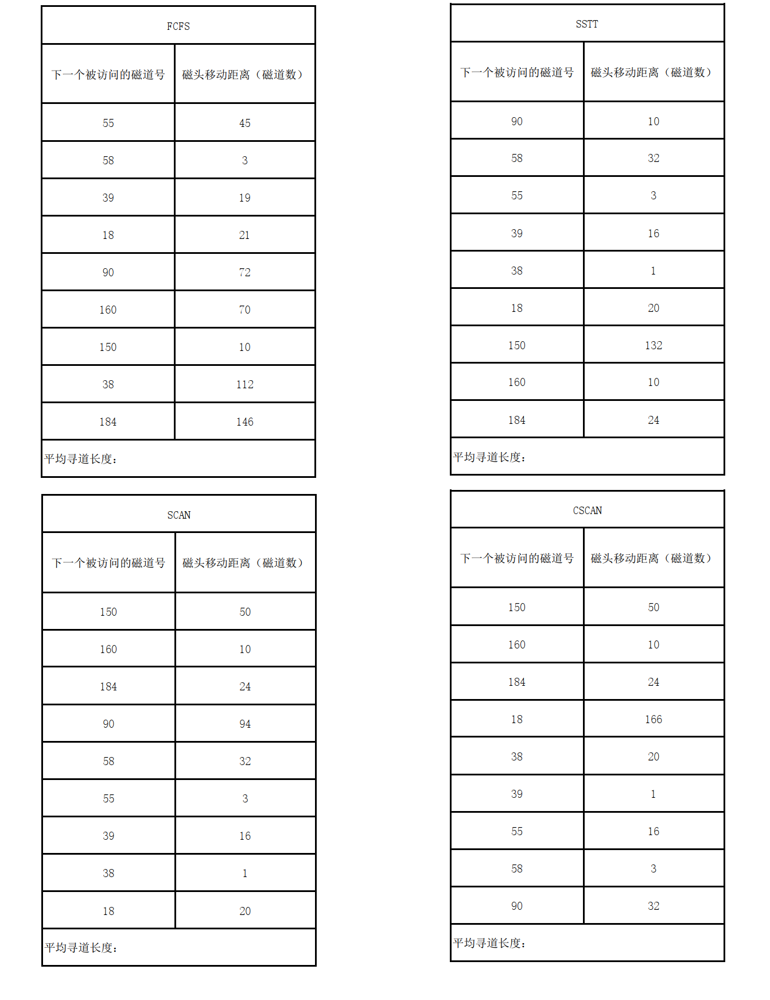
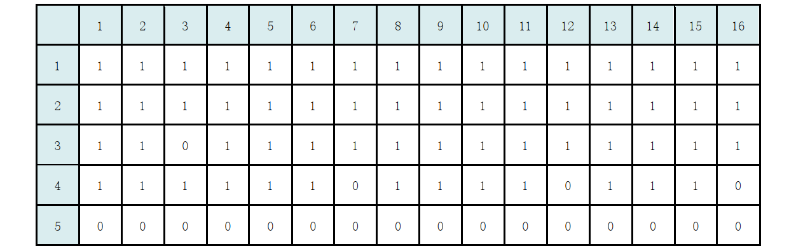

> 优质题库转载出处
>
> https://cloud.tencent.com/developer/article/2094977
>
> 本篇目只是对其格式进行了部分美化

参考书本：计算机操作系统第四版 电子科技大学出版社 

## 一、选择题

### 第1章习题

下列不属于操作系统目标的 是（）
 A. 方便性
 B. 有效性
 C. 可扩充性
 D. 开放性
 E. 并发性
 正确答案: E
 书本位置: P1 1.1.1
 2.下列关于操作系统的作用错 误的是（）
 A. 作为用户与计算机硬件系统 之间的接口
 B. 作为计算机系统资源的管理 者
 C. 实现对计算机资源的抽象
 D. 管理和控制用户的日常生活
 正确答案：D
 书本位置：P2 1.1.2 1 2 3
 3.在早起无操作系统时代，下面 关于人工操作方式的说法错误 的是（）
 A. 用户独占全机，资源利用率低
 B. 主机等待人工操作，cpu和内 存利用率低
 C. 人工速度慢但智能化程度高
 D. 脱机输入输出技术提高了 cpu和I/O速度
 正确答案：C 智能化高错
 书本位置： P3 1.2.1 1
 4.下列关于单道批处理系统特 点的说法错误的是（）
 A. 每次只允许一道作业运行
 B. 具有并发性特点
 C. 资源利用率低
 D. 系统吞吐量低
 E. 作业顺序执行
 正确答案：B无并发性
 书本位置： P6 1.2.2 1 2
 5.下列关于多道批处理系统特 点的说法错误的是（）
 A. 资源利用率高
 B. 系统吞吐量大
 C. 平均周转时间长
 D. 有良好的交互性
 正确答案：D 无交互性
 书本位置： P8 1.2.3 2
 6.下列不属于操作系统主要作 用的是（）
 A. 组织和管理计算机软硬件资 源
 B. 合理地对各类进程进行调度
 C. 高级程序设计语言的编译处 理
 D. 为用户和计算机提供有好的 交互界面
 正确答案：C 无高级程序设计语言编译处理功能 编译器（一种程序）的功能
 书本位置：
 7.下列关于分时系统的特征错 误的是（）
 A. 多路性
 B. 独占性
 C. 及时性
 D. 交互性
 E. 抢占性
 正确答案：E 无抢占性
 书本位置： P10 1.2.4 3
 8.下列关于实时系统的特征错 误的是（）
 A. 具有多路性特点
 B. 很好的独立性
 C. 广泛而且突出的交互性能
 D. 高可靠性
 正确答案：C 交互性:仅限于访问系统中某些特定的专用服务程序
 书本位置： P11 1.2.5 3
 9.下列关于操作系统基本特性 错误的是（）
 A. 并发性
 B. 并行性
 C. 共享性
 D. 虚拟性
 E. 异步性
 正确答案：无并行性
 书本位置： P14 1.3
 10.下列关于操作系统基本特 性错误的是（ ）
 A. 并发也叫并行，是指多个进程 同时发生
 B. 资源共享也称资源复用，分为互 斥共享和同时访问两种方式
 C. 并发和共享是操作系统最基 本的两个特征
 D. 虚拟技术包括时分复用和空分复用 两种，虚拟设备技术属于时分复用
 E. 异步性是指在并发环境中，进程的运 行时停停走走的，而不是一气呵成的
 正确答案：A 并行:同一时刻 并发:同一时间段
 书本位置： P14 1.3
 11.下列不是操作系统主要功 能的是（ ）
 A. 处理机管理功能
 B. 存储器管理功能
 C. 设备管理功能
 D. 文件管理功能
 E. 邮件管理功能
 正确答案：E 无邮件管理功能
 书本位置： P17 1.4
 12.操作系统为用户提供各种 接口，下列错误的是（）
 A. 联机用户接口
 B. 脱机用户接口
 C. 图形用户接口
 D. 硬件接口
 E. 程序接口
 正确答案：D 不提供硬件接口
 书本位置： ABC:P21 1.4.5 1 E:P22 1.4.5 2
 13.在微内核OS中，下列不是微 内核基本功能的是（）
 A. 进程管理
 B. 低级存储器管理
 C. 终端和陷入管理
 D. 文件管理
 正确答案：D 文件管理:操作系统功能
 书本位置： P31 1.5.4 2
 14.下列关于并发和并行的说 法错误的是（）
 A. 并发是指多个事件在同一时 间间隔内发生
 B. 并行是指多个事件在同一时 刻发生
 C. 在单机系统内进程只能并发 执行，不能并行
 D. 并发和并行是对同一现象的 两种不同称呼，本质是一样的
 正确答案：D 并行:同一时刻 并发:同一时间段
 书本位置： P14 1.3
 15.采用多道程序设计技术，可 以充分发挥（）的并行工作能 力 I.处理机与设备Ⅱ.设备与 设备III.处理机与存储器
 A. 只有I
 B. 只有Ⅱ
 C. I和II
 D. I、Ⅱ和III
 正确答案：C
 书本位置：
 16.计算机操作系统属于（）
 A. 应用软件
 B. 系统软件
 C. 工具软件
 D. 办公软件
 正确答案：B
 书本位置： P1第一段
 17.下列不允许用户以交互方 式使用的操作系统是（）
 A. 多道批处理操作系统
 B. 分时操作系统
 C. 实时操作系统
 D. 分布式操作系统
 正确答案：A 无交互性
 书本位置： P7 1.2
 18.设计实时操作系统是，首先 应该考虑的是（）
 A. 可靠性和灵活性
 B. 实时性和可靠性
 C. 分配性和可靠性
 D. 灵活性和实时性
 正确答案：B
 书本位置： P12 1.2.5 3
 19.操作系统提供给编程人员 的接口是（）
 A. 库函数
 B. 高级语言
 C. 系统调用
 D. 子程序
 正确答案：C 系统调用
 书本位置：
 20.已知某多道批处理系统中有P1 和P2两个作业，P2比P1晚10ms到 达，两道作业的操作要求（顺序）如下 P1:计算60ms,I/O操作80ms,计算 20ms P2:计算120ms,I/O操作40ms,计 算40ms 若不考虑调度和切换时间，则完成 两道作业需要的时间最少是（）
 A. 240ms
 B. 260ms
 C. 340ms
 D. 360ms
 正确答案：B
 书本位置： P8 1.2.3 1

### 第2章习题

下列关于程序并发执行的特 征正确的是（） I.顺序性 II.间断性 III封闭 性 IV.开放性 V.可再现性 VI. 不可再现性
 A. IⅡV
 B. I IV V
 C. II IV VI
 D. ⅡⅡVI
 正确答案：C
 书本位置：P38 2.1.3 2
 2.下列关于进程的说法错误的 是（）
 A. 进程是程序在某个数据集合 上的一次执行活动
 B. 进程是系统进行资源分配的 独立单位
 C. 进程是系统调度的独立单位
 D. 进程只是一次抽象的活动
 正确答案：D
 书本位置：P39 2.2.1 (1)(3)
 3.下列不是进程特征的是（）
 A. 动态性
 B. 并发性
 C. 并行性
 D. 独立性
 E. 异步性
 正确答案：C
 书本位置：P39 2.2.1 2
 4.下列不是进程基本状态的是 ( ）
 A. 阻塞状态
 B. 执行状态
 C. 挂起状态
 D. 就绪状态
 正确答案：C
 书本位置：P40 2.2.2 1
 5.下列关于进程状态变换的说 法错误的是（）
 A. 处于就绪态进程获得调度后 转为执行态
 B. 处于执行态的进程因时间片 用完而转为阻塞态
 C. 处于阻塞态的进程因等待的 事件发生而转为就绪态
 D. 处于执行态的进程因I/O请求 而转为阻塞态
 正确答案：B 时间片用完转就绪态
 书本位置：P40 2.2.2 2
 6.下列关于进程控制块的描述 错误的是（）
 A. 是系统管理和控制进程的一 个功能模块
 B. 是进程存在的标志
 C. 是系统实现对进程进行管理 的数据结构
 D. 是系统实现对进程调度的数 据结构
 正确答案：A
 书本位置：P44 2.2.4
 7.下列关于处理机执行时状态 的描述错误的是（）
 A. 程序运行在系统态时，具有很 高权限，可以执行一切指令
 B. 程序运行在系统态时，只能执 行特权指令
 C. 程序运行在用户态时，只能执 行普通指令
 D. 操作系统一般运行在系统态，而 用户程序一般运行在用户态
 正确答案：B 执行一切指令
 书本位置：P47 2.3.1
 8.操作系统内核的资源管理功 能一般不包括（）
 A. 进程管理
 B. 存储器管理
 C. 设备管理
 D. 作业管理
 正确答案：D
 书本位置：P47 2.3.1 2
 9.下列关于进程控制的说法错 误的是（）
 A. 创建态进程获得许可后转为 就绪态
 B. 进程终止时，应该先终止其子 孙进程
 C. 进程阻塞是进程自己调用阻 塞原语，所以是一个主动行为
 D. 进程释放资源时应唤醒处于 阻塞状态的进程
 E. 进程被挂起时会被移出内存， 操作系统将失去对其控制
 F. 静止就绪态进程被激活后，通 常具有较高的优先权（被调度）
 正确答案：D 释放资源唤醒就绪态进程
 书本位置：P46 2.3
 10.对进程执行挂起操作后，下 列状态变化错误的是（）
 A. 执行态转为静止执行态
 B. 活动阻塞态转为静止阻塞态
 C. 活动就绪态转为静止就绪态
 D. 执行态转为静止就绪态
 正确答案：A
 书本位置：P42 2.2.3 2
 11.下列关于多道程序运行环 境中进程之间关系的描述错误 的是（）
 A. 协作进程之间具有直接制约关系， 它们之间不存在资源竞争问题
 B. 无关进程之间会因为竞争临 界资源而发生间接制约关系
 C. 临界资源也叫互斥资源，必须 互斥使用
 D. 并发进程共享所有系统资源
 正确答案：A
 书本位置：P2.4.1 1 2
 12.下面关于临界区的描述错 误的是（）
 A. 临界区是内存中的一个特殊 区域
 B. 临界区是进程访问临界资源 的那段代码
 C. 在临界区之前设置进入区，以 检查临界资源的状态并对其访 问标志做出正确设置
 D. 在临界区之后设置退出区， 用于释放被锁定的临界资源
 正确答案：A 每个进程中访问临界资源的那段代码
 书本位置：P55 2.4.1 3
 13.下列不是同步机制应该遵 循的准则的是（）
 A. 空闲让进
 B. 忙则等待
 C. 有限等待
 D. 让权等待
 E. 忙等待
 正确答案：E
 书本位置：P55 2.4.1 4
 14.已知记录型信号量S,整型域 S.value,下列说法错误的是（）
 A. S.value的初值最大，表 示系统拥有该资源的数 目
 B. S.value表示当前可用资源 数目，所以初值必须置0
 C. S.value<0时，其绝对值表 示当前被阻塞的进程数目
 D. 执行wait(S）操作时，S.value 的值-1,执行signal(S）操作 时，S.value的值+1
 E. 在信号量S上执行的wait(）操作 和signal0操作都是原语操作
 正确答案：B 初值设置为资源数目
 书本位置：P58 2.4.3 2
 15.下列关于管程的描述错误 的是（）
 A. 管程是一种同步机制
 B. 管程定义了一个数据结构和并发 进程对其所能进行的一组操作
 C. 管程是一个可单独变异的基本程 序单位，并发进程必须互斥使用
 D. 管程实现了信息隐蔽
 E. 管程具有动态性，在进程调用 后被撤销
 正确答案：E 管程是资源管理模块,供进程调用不会被撤销
 书本位置：P64 2.4.5 1
 16.下列不是进程高级通信机 制的是（）
 A. 基于共享存储器的通信方式
 B. 基于共享数据结构的通信方 式
 C. 管道通信系统
 D. 消息传递系统
 E. 客户机/服务器系统
 正确答案：B
 书本位置：P73 2.6.1
 17.下列关于信箱通信正确的是（） I.是低级通信Ⅱ.是高级通 信III.是直接通信 IV.是间接接通信 V.以消息为单位通信 VL.以字节为单位通信
 A. IⅡV
 B. II IV VI
 C. II IV V
 D. IIV VI
 正确答案：C
 书本位置：P78 2.6.2 2
 18.在引入线程的操作系统中， 下列关于线程的描述错误的是 (）
 A. 线程是调度的基本单位
 B. 线程具有比进程更好的并发 性
 C. 资源属于进程，线程仅拥有 TCB等少量资源
 D. 线程拥有比进程更高的独立 性
 E. 线程的开销比进程小
 F. 和进程相比，线程能更好地支 持多处理机系统
 正确答案：D 进程的独立性更高
 书本位置：P82 2.7.2
 19.下列不属于线程状态的是 (）
 A. 执行状态
 B. 就绪状态
 C. 阻塞状态
 D. 挂起状态
 正确答案：D
 书本位置：84 2.7.3
 20.用信号量管理互斥资源时， 信号量的初值通常定义为（）
 A.-1
 B.0
 C.1
 D. 由用户自己确定
 正确答案：C
 书本位置：P61 2.4.4 1(1)
 21.系统是通过（）来感知进程 的存在并对其进行控制和管理。
 A. JCB
 B. PCB
 C. TCB
 D. FCB
 正确答案：B
 书本位置：P39 2.2.1 1
 22.操作系统为获得调度的作 业创建第一个进程，但由于内存 紧张暂时不能分配内存空间，此 时进程状态是（）
 A. 初建状态
 B. 就绪状态
 C. 阻塞状态
 D. 终止状态
 正确答案：A
 书本位置：P41 2.2.2 3
 23.下列不属于进程实体的选 项是（）
 A. 代码段
 B. 数据段
 C. 进程控制块
 D. 运行过程
 正确答案：D
 书本位置：P39 2.2.1 1
 24.已知信号量S的初始值为5, 在S上连续执行了9次wait操作 后S的值应该为（）
 A.-9
 B.-5
 C.-4
 D.4
 正确答案：C
 书本位置：P58 2.4.3 1
 25.已知记录型信号量S,当前 S.value的值为-5,下列选项 错误的是（）
 A. 当前有5个进程获得资源S
 B. 当前有5个进程阻塞在资源 S上
 C. 当前阻塞队列的长度为5
 D. 如果S是资源信号量，则表示当 前系统缺少5个资源S
 正确答案：A
 书本位置：P58 2.4.3 2

### 第3章习题

下列关于处理机调度层次的 描述错误的是（）
 A. 高级调度、中级调度、低级 调度
 B. 作业调度、内存调度、进程 调度
 C. 长程调度、中程调度、短程 调度
 D. 人工调度、智能调度、紧急 调度
 正确答案：D 无此层次划分
 书本位置： P92 3.1.1
 2.下列关于处理机调度功能的 描述错误的是（）
 A. 作业调度的主要功能是根据某种算法 从外存后备队列中选择合适的作业调 入内存，并为其创建第一个进程
 B. 中程调度的主要功能是当内存紧张是挂起部分 暂时不运行的进程并在内存有空闲时激活部分 被挂起的进程，以提高内存利用与和系统否时
 C. 进程调度的主要功能是根据某种算 法从就绪队列选择合适进程调度到 处理机运行
 D. 进程调度是处理机调度中最基本最高 级的调度，在所有类型的操作系统中 都必须配置。
 正确答案：D 进程调度是低级调度
 书本位置： P92 3.1.1
 3.下列不是处理机调度算法共 同目标的是（）
 A. 提高系统资源利用率
 B. 处理机时间分配的公平性
 C. 系统资源分配的平衡性
 D. 策略的强制执行
 E. 平均周转时间短和截止时间 保证
 正确答案：E 实时系统的目标
 书本位置： P93 3.1.2
 4.对作业的操作课分为若干步 骤，即作业步，一个典型作业操 作通常分为三个步骤，下列错误 的是（）
 A. 编辑
 B. 编译
 C. 链接装配
 D. 运行
 正确答案：A
 书本位置： P95 3.2.1 1 (2)
 5.下列关于FCFS调度算法， 错误的是（）
 A. 是最简单的调度算法，易于实 现
 B. 既可用于作业调度，也可用于 进程调度
 C. 严格按照先来后到次序进行调度，是 所有调度算法中最公平和高效的算法
 D. 缺点是没有考虑短进程和进 程紧迫程度
 正确答案：C 不是最高效的算法
 书本位置： P96 3.2.3 1
 6.下列关于短作业优先调度算 法，错误的是（）
 A. 以作业运行时间的长短为优 先级，作业越长，优先级越高
 B. 难以准确估算作业的运行时 间
 C. 不利于长作业，可能初衔接现 象
 D. 该算法可用于进程调度
 E. 没有考虑作业的紧迫程度
 正确答案：A 作业越短优先级越高
 书本位置： P96 3.2.3 2
 7.下列关于进程调度任务的描 述错误的是（）
 A. 保存处理机现场信息
 B. 将当前进程的状态由执行态 转为阻塞态
 C. 从就绪队列选择合适新进程
 D. 把处理器分配给新进程
 正确答案：B 就绪态转执行态
 书本位置： P98 3.3.1
 8.进程切换时会发生两对上下 文切换，下列最正确的选项是（）
 A. 当前进程下，分配程序上
 B. 分配程序下，新进程上
 C. 当前进程下，新进程上
 D. 新进程上，当前进程下
 E. 只有A和B是正确的
 正确答案：E
 书本位置： P99 3.3.1 2 (3)
 9.进程调度方式可分为抢占式 和非抢占式，下列关于非抢占式 调度算法的描述错误的是（）
 A. 当前进程运行完毕时，可触发 进程调度
 B. 当前进程阻塞时，可触发进程 调度
 C. 当前进程执行原语操作时，可 触发进程调度
 D. 当前进程主动放弃处理机
 E. 实现简单，系统开销小，广泛实 用于各种类型操作系统
 正确答案：E 适用于大多数批处理系统,但不能用于,分时系统和大多数实时系统
 书本位置： P100 3.3.1 3 1)
 10.下列关于抢占式进程调度 算法的描述错误的是（）
 A. 按优先权原则抢占
 B. 按短进程优先原则抢占
 C. 按时间片原则抢占
 D. 按用户意志抢占
 正确答案：D
 书本位置： P100 3.3.1 3 2)
 11.下列关于时间片轮转调度 算法的描述错误的是（）
 A. 就绪队列中的进程按进程大小每 次可获取一个或者多个时间片
 B. 如果在一个时间片内进程运行结束但 时间片尚未用完，将立即触发新的调度， 并启动一个新的时间片
 C. 每一个时间片时都将触发一次中断，并激活调度进行新的调度
 D. 如果时间片用完但进程尚未结束则 该进程状态将转为就绪状态，并插入 就绪队列尾部
 E. 时间片的大小应以略大于一次更型交互所需时 问为宜，时间片太小会因为进程切换频离而导致 系统开销过大，太人则算法退化为FCFS算法。
 正确答案：A 一个进程每次只能获取一个时间片
 书本位置： P100 3.3.2
 12.下列关于多级反馈队列调 度算法的描述错误的是（）
 A. 设置多个就绪队列，队列之 间按优先级实行抢占式调度
 B. 新进程按优先级高低分别进 入不同的队列
 C. 同一队列中的进程采用 FCFS调度算法
 D. 不同队列中的时间片大小不 同，且按队列序号递增
 E. 算法能较好地满足各种类型 用户的需要
 正确答案：B 进程之间没有优先级
 书本位置： P103 3.3.5
 13.下列关于实时调度算法的 描述错误的是（）
 A. 实时调度算法分为抢占式和 非抢占式，多采用抢占式调度
 B. 截止时间保证是实时调度的 重要特征之一
 C. 强大的系统处理能力和快速切 换机制是实时调度的重要特征
 D. 软实时任务比硬实时任务具有更高的 紧迫性，因此必须采用抢占式调度来 保证任务及时完成。
 正确答案：D
 书本位置： P106 3.4.2 1 2
 14.下列关于资源的描述错误的是（）
 A. 可重用性资源是可供用户重复使用的 永久性资源，用户必须按照“请求–> 使用–>释放”的顺序使用
 B. 可消耗性资源是临时性资源，在进程 运行过程中其数目是变化的，资源使 用后被消耗掉，无需归还
 C. 可抢占性资源可以按照优先权原则被 高优先级进程抢占，比较典型的是处 理机和内存
 D. 大多数硬件资源属于不可抢 占性资源，如打印机
 E. 互斥资源都是不可抢占性资 源
 正确答案：E 互斥资源可以是可抢占资源和不可抢占资源
 书本位置： P113 3.5.1
 15.下列不会引起死锁的是（）
 A. 竞争不可抢占性资源
 B. 竞争可消耗性资源
 C. 进程推进顺序不当
 D. 采用抢占式调度算法
 正确答案：D
 书本位置： P113 3.5.2 1 2 3
 16.下列不是产生死锁的必要 条件的是（）
 A. 互斥条件
 B. 请求和保持条件
 C. 可抢占条件
 D. 循环等待条件
 正确答案：C 不可抢占条件
 书本位置： P116 3.5.3 2
 17.下列不是处理死锁的方法 的是（）
 A. 预防
 B. 避免
 C. 检测与解除
 D. 分类排序
 正确答案：D
 书本位置： P116 3.5.3 3
 18.下列不能作为预防死锁措 施的是（）
 A. 破坏“互斥”条件
 B. 破坏“请求和保持”条件
 C. 破坏“不可抢占”条件
 D. 破坏“循环等待”条件
 正确答案：A 互斥条件不能破坏
 书本位置： P3.6 116
 19.下列关于预防死锁的描述 错误的是（）
 A. 采用一次性分配资源的方法可以预防 死锁的发生，但资源浪费严重，且易发 生饥饿现象
 B. 对资源采用动态分配并在资源使用完 后及时释放的方法，能有效预防死锁目 具有比静态资源分配法更高的效率
 C. 破坏“不可抢占条件”可能导致进 程的执行被无限延迟，且增加系统开 销
 D. 对资源进行编号，强制进程对资源进行有序申请 此法简单易行，不但能有效衡防死锁发生，而且能提高资源的利用率,是最理想的预防死锁的方法
 正确答案：D 如果作业使用资源的顺序与系统规定的顺序不同会造成资源浪费
 书本位置： A:P117 3.6.1 1 B:P117 3.6.1 2 C:P118 3.6.2 D:P118 3.6.3
 20.若4个进程都需要2个资源 A,则系统最少应提供多少个A 资源才能保证不会发生死锁（）
 A.3
 B.4
 C.5
 D.6
 正确答案：C 4*(2-1)+1 = 5
 书本位置： P119 3.7.1 3
 21.程序与进程的本质区别是 (）
 A. 前者独占内存，后者共享内存
 B. 前者独占处理机，后者共享处 理机
 C. 前者静态，后者动态
 D. 前者大，后者小
 正确答案：C
 书本位置：
 22.中断扫描机构扫描中断寄 存器的时间是（）
 A. 每个时间片结束时
 B. 每个指令周期末尾
 C. 进程阻塞时
 D. 进程结束时
 正确答案：B
 书本位置：
 23.已知三个作业J1、J2、J3 同时到达，作业执行所需时间分 别为T1、T2、T3,且 T1<T2<T3,采用短作业优先调 度算法，平均周转时间是（）
 A. T1+T2+T3
 B. (T1+T2+T3）/3
 C. (3T1+2T2+T3）/3
 D. T1+2T2+3T3
 正确答案：C 执行顺序T1->T2->T3 J1周转时间=T1 J2周转时间=T1+T2 J3周转时间=T1+T2+T3 平均周转时间=(3T1+2T2+T1)/3
 书本位置： P96 3.2.3
 24.为实现两进程互斥，设置互 斥信号量mutex,当mutex的 值为0时，表示（）
 A. 没有进程进入临界区
 B. 有一个进程进入临界区
 C. 可能有一个进程阻塞
 D. 一个进程进入临界区，另一个 进程阻塞
 正确答案：B
 书本位置： P61 2.4.4 1
 25.系统有11台打印机和N个 并发进程，每个进程请求3台打 印机，为确保不发生死锁，N的 值最大为多少（）
 A.3
 B.4
 C.5
 D.6
 正确答案：C (3-1)*N+1=11
 书本位置： P119 3.7.1 3

### 第4章习题

下列关于存储器的说法错误 的是（）
 A. CPU寄存器容量最小，速度最快
 B. 高速缓存和磁盘缓存实际上 都是主存中的一个区域
 C. 寄存器和主存储器都是CPU所能访问到的，又称可执行存储器
 D. 高速缓存用于备份CPU最近访问 的内存数据，以减少CPU访问内存 的次数
 E. 磁盘缓存用于暂存主存与磁盘的 交互数据，以缓和高速主存与低速 磁盘之间的矛盾
 正确答案：B 高速缓存是介于寄存器和存储器之间的存储器
 书本位置： P130 4.1.2 4.1.3
 2.程序运行前一般要进行几个 步骤的操作，下列错误的是（）
 A. 编译
 B. 链接
 C. 汇编
 D. 装入
 正确答案：C
 书本位置： P132 4.2
 3.下列关于程序链接的说法错 误的是（）
 A. 静态链接是在程序装入前将所有 目标模块和库函数链接成一个完 整的可执行程序，且不再分开
 B. 装入时动态链接是在装入时才将各目 标模块进行链接，各目标模块仍独立存 放并未形成一个完整的可执行程序，便 于后期维护和对目标模块的共享
 C. 运行时动态链接是对装入时动态链接的 种改进，部分不常用模块并不装入内存 只在运行需要时再临时链接和装入，以加 快程序装入速度和提高内存利用率。
 D. 只有静态链接时需要修改模块相对地址并变换模块的外部调用符， 其他链接方式不需要。
 正确答案：D 其他链接方式也需要
 书本位置： P134 4.2.2 1 2 3
 4.程序运行前需将装入模块装 入内存，下列不是程序装入方式 的是（）
 A. 绝对装入方式
 B. 相对装入方式
 C. 可重定位装入方式
 D. 动态运行时装入方式
 正确答案：B 无相对装入
 书本位置： P132 4.2.1
 5.下列关于重定位的说法错误 的是（）
 A. 重定位是指在装入目标程序 时将指令和数据的逻辑地址 变换为实际物理地址的过程
 B. 程序绝对装入时不需要进行重 定位操作
 C. 目标程序静态重定位后，系统 可以在必要时进行内存紧凑操 作，以获取更大的空闲区
 D. 动态重定位方式下，目标程序 在装入时并不进行重定位操作， 只在指令执行时才临时进行地 址变换
 E. 只有在动态重定位方式下，内存 紧凑操作才可以进行
 正确答案：C 静态重定位内存不能改变 无法进行内存紧凑操作
 书本位置： P132 4.2.1
 6.下列关于分区分配存储管理 的说法错误的是（）
 A. 采用连续分配方式
 B. 单一连续分配方式只用于单用户单任务系统中
 C. 固定分区分配方式下，各分区的大小可以相等，也可以不等
 D. 可变分区分配方式是根据进 程的实际需要分配内存，因 此不存在碎片问题。
 正确答案：D 存在内部碎片
 书本位置： A:P135 4.3 B:P135 4.3.1 C:P135 4.3.2 1
 7.下列关于动态分区分配算法 说法错误的是（）
 A. 首次适应算法每次分配空间时都 从表（链）首开始查找操作集中在低 地址段，容易在低地址段形成碎片 并增加系统开销
 B. 循环首次适应算法每次分配空间 时都从表（链）首开始查找操作均 匀分散，缺点是容易导致缺乏大的 空闲区
 C. 最佳适应算法每次最小的可分配 空闲分区给进程，因此效率最高，不 易形成碎片。
 D. 最坏适应算法每次选择最大的空 闲分区分配给进程，不易形成碎片。
 正确答案：B从上次找到的空闲分区开始 C每次分配后所切割下来的剩余部分总是最小,容易产生碎片
 书本位置： P140 4.3.4
 8.下面关于对换技术的说法错 误的是（）
 A. 对换技术是在内存紧张时将暂时 不运行的进程换出到外存，必要时 再换入内存，以此调节内存，改善内 存利用率。
 B. 可分为整体对换和部分对换
 C. 在具有对换功能的系统中，磁盘 空间被分为对换区和文件区
 D. 当内存紧张时，系统总是选择最大 的进程换出内存，一次性获得最多 的内存空间
 E. 换入操作时，在已换出进程中 优先选择就绪状态进程换入。
 正确答案：D 优先级低的或驻留时间最长的紧凑换入内存
 书本位置： A:P145 4.4.1 1 B: P145 4.4.1 2 C:P146 4.4.2 1 D:147 4.4.3 2
 9.下列不是离散分配方式的是 (）
 A. 动态分区分配方式
 B. 分页存储管理方式
 C. 分段存储管理方式
 D. 段页式存储管理方式
 正确答案：A 连续分配方式
 书本位置： P148 4.5
 10.下列关于分页存储管理的 说法错误的是（）
 A. 页是进程的逻辑地址空间单位 块是内存的物理地址空间单位 页和块大小相同
 B. 进程逻辑空间的页是连续的， 分配内存后获得的物理块可以 是不连续的
 C. 页面过大会导致内部碎片增多 过小会导致页表过长和磁盘访 问过于频繁
 D. 分页方式下内存利用率高，但 仍存在外部碎片问题
 正确答案：D 存在内部碎片
 书本位置： P148 4.5.3
 11.已知某分页系统中，页的大 小为1K,则逻辑地址2170的 页号和页内偏移量分别是（）
 A. 2和170
 B. 2和122
 C. 1和170
 D. 1和122
 正确答案：B 1K=1024 页号=2170/1024=2 偏移量=2170%1024=122
 书本位置： P148 4.5.1 2
 12.已知某分页系统中，页的大 小为1K,逻辑地址A=2170,经 查页表得知其对应的物理快号 为5,则A的物理地址应为（）
 A. 5170
 B. 2170
 C. 5242
 D. 2242
 正确答案：C 1K=1024 偏移量=2170%1024=122 物理地址5*1024+122=5242
 书本位置： P148
 13.已知某分页系统中，页的大 小为1K,进程P的页表长度为8, 现有逻辑地址A=8570,则A的 物理地址应为（）
 A. 8570
 B. 8192
 C. 题干信息不够，无法求出A的 物理地址
 D. 所给地址A非法
 正确答案：D 1K=1024 页号=8570/1024=8>=页表长度8 A越界非法
 书本位置： P148
 14.分页存储管理方式下处理 器访问一次逻辑地址，下列说法 错误的是（）
 A. 未设置快表时，至少访问内存 2次
 B. 可能多次访问内存
 C. 设置快表时，只需访问内存1 次
 D. 至少访问内存1次
 正确答案：C 不设置快表,至少访问两次,设置快表,在页表中找到访问内存1次,没找到需将页表数据写入快表,访问了两次内存
 书本位置： P151 4.5.3
 15.已知有快表的（基本分页系 统）中，处理器访问一次内存的 时间为t,访问一次快表的时间 为v,则处理器访问一次逻辑地 址所需时间，下列选项错误的是 (）
 A. 可能为2t
 B. 可能为t+v
 C. 可能为2t+2v
 D. 如果地址溢出，则处理器不访 问内存和快表
 正确答案：A
 1.在快表中有,先访问快表,访问时间v,形成物理地址需访问内存?访问内存时间v?总时间v+t
 2.在快表没有,访问时间v,再访问页表,页表在内存中,一次内存访问时间v,将页表数据写入快表里面,所以第二次访问快表,访问时间v,再访问物理地址,访问时间t?总时间2v+2t
 书本位置： P151 4.5.3
 16.下列不是分段存储管理方 式优点的是（）
 A. 方便用户编程
 B. 便于信息共享与保护
 C. 便于信息的动态增长
 D. 适合于动态链接
 E. 便于内存空间分配，提高内存 利用率
 正确答案：E 分页管理方式的优点
 书本位置： P155 4.6.
 17.关于分页和分段的区别，下 列说法错误的是（）
 A. 页是信息的物理单位，段是信 息的逻辑单位
 B. 页的大小固定由系统决定，段的大小 不固定，取决于用户所编写的程序
 C. 分页方式下用户程序的地址空间 是一维的，而分段方式下用户程序 的地址空间是二维的
 D. 分页方式完全消除了碎片，内存利 用率高，但分段方式能更好地满足 用户的需求
 正确答案：D 分页有内部碎片
 书本位置： P158 4.6.2 4
 18.关于段页式存储管理方式， 下列说法错误的是（）
 A. 内地址空间分块，作业地址空 间分段，段内又分页
 B. 每个作业有唯一的一个段表， 每个段对应一个页表
 C. 逻辑地址结构由段号、段内页号和页内地址三部分构成
 D. 在未设置快表的情况下，处理器访问一次逻辑地址需三次访问内存
 E. 段页式存储管理方式结合了分页和分 段的特点因此既不是连续分配方式 也不是离散分配方式
 正确答案：E 分页 分段 段页式都是离散分配方式
 书本位置： P160 4.6.4 1
 19.下列属于常规存储器特征 的是（） I.一次性 II.多次性 III.驻留性 IV.对换性 V.虚拟性 VI 异步性
 A. 只有I和VI
 B. 只有Ⅱ和IV
 C. 只有Ⅱ、IV和V
 D. 只有I和III
 正确答案：D
 书本位置： P164 5.1.1 1
 20.下列属于虚拟存储器特征 的是（） I.一次性 Ⅱ.多次性 III.驻留 性 IV.对换性 V.虚拟性 VI 异步性
 A. 只有I和VI
 B. 只有Ⅱ和IV
 C. 只有Ⅱ、IV和V
 D. 只有I和III
 正确答案：C
 书本位置： P166 5.1.2 2
 21.下列关于程序运行的局部 性原理说法错误的是（）
 A. 包括时间局限性和空间局限性
 B. 时间局限性是指程序的运行时 间是有限的，而不能使无限的
 C. 如果程序中的某条指令被执行，则在不久之后它可能被再次执行
 D. 如果程序访问了某个存储单元，则在不久之后它附近的存储单元也 将被访问到
 正确答案：B 时间局限性是指C 空间局限性是指D
 书本位置： P165 5.1.1 2
 22.下面关于虚拟存储器的说 法错误的是（）
 A. 具有请求调入功能
 B. 具有置换功能
 C. 逻辑容量的大小决定于内存 容量和外存容量之和
 D. 运行速度接近于外存，每位成 本接近于内存
 正确答案：D 运行速度接近于内存 成本接近于外存
 书本位置： P166 5.1.2 1
 23.下列关于虚拟存储器的实 现方法，正确的是（） I.基本分页系统 Ⅱ.请求分页 系统 III.基本分段系统 IV.请 求分段系统V.段页系统
 A. I和VI
 B. I和III
 C. Ⅱ和IV
 D. I、III和V
 正确答案：C
 书本位置： P167 5.1.3 1 2
 24.下面关于请求分页系统中 页表字段的描述错误的是（）
 A. 含有页号、物理块号、状态 位、访问位、修改位、外存 地址等字段
 B. 状态位用来表示页面是否在 内存中
 C. 访问位用来记录页面最近一 段时间是否被访问过
 D. 修改位用来标识页面最近一 段时间是否被修改过
 正确答案：D 修改位：用来标识调入内存后是否被修改过
 书本位置： P168 5.2.1 1
 25.在请求分页中对逻辑地址A 进行地址变换，下列说法错误的 是（）
 A. 如果A的页号大于页表长度， 则产生越界中断
 B. 如果A的页号不在快表中，则 产生缺页中断
 C. 如果A对应页表表目中状态位为0,则产生缺页中断
 D. 如果产生缺页中断，且所属进 程已没有空闲物理块，则会产生页面置换
 正确答案：B 页号不在内存中 产生缺页中断
 书本位置： P168 5.2.1 2
 26.在请求分页系统中，内存分 配策略与页面置换策略搭配，下 列错误的是（）
 A. 固定分配局部置换
 B. 固定分配全局置换
 C. 可变分配局部置换
 D. 可变分配全局置换
 正确答案：B
 书本位置： P172 5.2.2 2
 27.在请求分页系统中，下列不 是物理块分配算法的是（）
 A. 平均分配
 B. 按比例分配
 C. 考虑优先权分配
 D. 随机分配
 正确答案：D
 书本位置： P172 5.2.2 3
 28.下面关于页面调入策略的 说法错误的是（）
 A. 采用预调页策略可一次性预先调 入多个页面，但预测的准确性不 高
 B. 请求调页策略只在缺页时才调 入，且每次只能调入一个页面
 C. 当系统的对换空间足够大时， 将全部页面从对换区调入，以提 高调页速度
 D. 若调入页面时内存已满则优先 选择一个已修改页面置换出去， 同时写盘
 正确答案：D 要按照某种置换算法置换出去
 书本位置： A:P172 5.2.3 1.(1) B:P172 2.(2) C:P173 2.(1) D:P173 3.
 29.下列关于影响缺页率因素 的描述错误的是（）
 A. 页面大小，页面过大或者过 小都会导致缺页率升高
 B. 分配给进程的物理块数越 多，缺页率越低
 C. 选择一个好的页面置换算 法是降低缺页率的一个重 要因素
 D. 程序的固有特性，程序的局 部性越高，缺页率越低
 正确答案：A 只有页面过小才会导致缺页率升高,过大反而降低
 书本位置： P174 5.2.3 4
 30.请求分页系统中，已知作业 的页面访问序列为 4,3,2,1,4,3,5,4,3,2,1,5,系统分 配给作业的物理块数为3,初始 时物理块均为空，若采用OPT页 面置换算法，则缺页次数为（）
 A.4
 B.5
 C.6
 D.7
 正确答案：D 最佳置换算法
 书本位置： P174 5.3.1 1
 31.请求分页系统中，已知作业的页 面访问序列为 4,3,2,1,4,3,5,4,3,2,1,5,系统分配给 作业的物理块数为3,初始时物理块 均为空，若采用FIFO页面置换算法 则页面置换次数为（）
 A.4
 B.5
 C.6
 D.7
 正确答案：C
 书本位置： P174 5.3.1 2
 32.请求分页系统中，已知作业 的页面访问序列为 4,3,2,1,4,3,5,4,3,2,1,5,系统分 配给作业的物理块数为3,初始 时物理块均为空，若采用LRU页 面置换算法，则缺页率数为（）
 A. 58%
 B. 50%
 C. 42%
 D. 83%
 正确答案：D 10/12 = 0.83
 书本位置： P174 5.3.2 1
 33.某请求分页系统采用简单 clock页面置换算法，有作业在 内存中有四个页面，第一至第四 个页面访问位的值依次为 1,0,1,0,若进行页面置换，则被 淘汰的页面是（）
 A. 第一个页面
 B. 第二个页面
 C. 第三个页面
 D. 第四个页面
 正确答案：B 找为0 的区域
 书本位置： P178 5.3.3 1
 34.某请求分页系统采用改进的 clock页面置换算法，有作业在内存 中有四个页面，第一至第四个页面 的（访问位，修改位）的值依次为 (1,0）,(1,1）,(0,1）,(0,0）,若进行页面 置换，则被淘汰的页面是（）
 A. 第一个页面
 B. 第二个页面
 C. 第三个页面
 D. 第四个页面
 正确答案：找(0,0)区域,没有从头开始找(0,1)区域,将访问位,置0,若还是没找到从头找(0,0),若还是没找到,再找(0,1)
 书本位置： P178 5.3.3 2
 35.已知请求分页系统中，处理 器访问一次内存的时间为t,访 问一次快表的时间为v,缺页中 断处理时间为w,若页面不在内 存，则处理器访问一次逻辑地址 所需时间为（）
 A. t+V+W
 B. 2(t+v）
 C. 2(t+v）+w
 D. 2(t+V+w）
 正确答案：C 不存在需访问2次快表,2次内存,所以总共2(t+v)+w
 书本位置： P181 5.3.5
 36.下列影响页面换进换出的 因素中，错误的是（）
 A. 页面置换算法的选择
 B. 将已修改页面写回磁盘的 频率
 C. 将磁盘数据读入内存的频 率
 D. 进程的大小
 正确答案：D 进程的大小无关,一个物理块存放一个进程
 书本位置： P180 5.3.4 1
 37.下面关于“抖动”产生的 原因错误的是（）
 A. 并发的进程数太多
 B. 系统分配给进程的物理块 数小于进程运行所需要的 最小物理块数
 C. 工作集窗口尺寸太大
 D. 缺页率太高
 正确答案：C 抖动是指CPU利用率随页面缺页率加大而趋于0的情况与工作集窗口大小无关
 书本位置： P182 5.4.1 2
 38.下面关于工作集的说法错 误的是（）
 A. 工作集是指在某段时间内 进程实际要访问的页面的 集合
 B. 将进程的全部工作集装入 内存，可降低缺页率
 C. 工作集随着窗口尺寸的增 大而增大
 D. 窗口尺寸越大越好
 正确答案：D 窗口尺寸太大缺页率反而改善不明显
 书本位置： P183 5.4.2
 39.下面关于“抖动”的预防 方法错误的是（）
 A. 采用全局置换策略
 B. 把工作集与进程调度相结 合，给缺页率偏高的进程分 配更多物理块
 C. 利用 “L=S”准则调节缺 页率
 D. 当缺页率偏高时，优先选择 优先级低的进程暂停
 正确答案：A 采用局部置换策略
 书本位置： P184 5.4.3
 40.在请求分段系统的地址变 换过程中，下列说法错误的是（）
 A. 虚地址段号大于段表长度时， 产生越界中断
 B. 虚地址段内偏移量大于段表长度时，产生越界中断
 C. 虚段不在内存时，产生缺段中断
 D. 存取方式不合时，触发保护中断
 正确答案：B 虚地址段内偏移量大于段长时，产生越界中断
 书本位置： C:P185 5.5.1 2 D: P188 5.2.2 3 1)

### 第5章习题

下列不是I/O系统管理对象 的是（）
 A. I/O设备
 B. 设备控制器
 C. DMA控制器
 D. 通道
 E. 存储器
 正确答案：E 存储器属于存储器（内存）管理对象
 书本位置：P191 6.1
 2.关于I/O系统的基本功能，下列说 法最准确的是（） ①隐藏物理设备的细节 ②实现 与设备无关性 ③提高处理机与 I/O设备的利用率 ④对I/O设备 进行控制 ⑤确保对设备的正确 共享⑥错误处理
 A. ①③⑤
 B. ②④⑥
 C. ①②③⑤
 D.①②③④⑤⑥
 正确答案：D
 书本位置：P192 6.1.1
 3.I/O系统分层，下列从下到上 排列正确的是（）
 A. 硬件、中断处理程序、设 备处理程序、设备独立性 软件、用户层软件
 B. 硬件、设备处理程序、中 断处理程序、设备独立性 软件、用户层软件
 C. 硬件、中断处理程序、设 备独立性软件、设备处理 程序、用户层软件
 D. 硬件、设备独立性软件、 中断处理程序、设备处理 程序、用户层软件
 正确答案：A
 书本位置：P193 6.1.2 1
 4.根据设备类型的不同I/O系 统向高层提供不同的接口，下列 错误的（）
 A. 块设备接口
 B. 流设备接口
 C. 网络通信接口
 D. 图形用户接口
 正确答案：D
 书本位置：P195 6.1.3
 5.设备的分类方法很多，下列 错误的是（）
 A. 按数据传输单位可以分为字 符设备和块设备
 B. 按使用特性可以分为存储设 备和I/O设备
 C. 按共享特性可分为独占设备 和共享设备
 D. 按传输速度可分为低速设备、 匀速设备和加速设备
 正确答案：D 低速设备 低速共享设备 高速共享设备
 书本位置：P196 6.2.1 1
 6.下列关于设备控制器的描述 错误的是（）
 A. 每个设备控制器只能控制一 个设备
 B. 设备控制器是设备与CPU之 间的接口
 C. 设备控制器可以分为流设备 控制器和块设备控制器
 D. 设备在设备控制器的控制下 工作
 正确答案：A 设备控制器可以控制一个或多个设备
 书本位置：P197 6.2.2
 7.下面关于设备控制器的功能 描述最准确的是（）
 A. 接受和识别命令
 B. 实现CPU和设备之间数据交 换
 C. 标识和报告设备状态
 D. 识别设备地址
 E. 进行数据缓冲
 F. 差错控制
 G. 上述选项全部正确
 正确答案：G
 书本位置：P198 6.2.2 1
 8.下列关于通道类型错误的是 ( ）
 A. 字节多路通道
 B. 字节选择通道
 C. 数组选择通道
 D. 数组多路通道
 正确答案：B
 书本位置：P201 6.2.4 2
 9.下列关于中断的说法错误的 是（）
 A. 外中断是指由外部设备引起 的中断
 B. 由CPU内部事件引发的中断 称为内中断，也叫陷入
 C. CPU在每个指令周期结束时检 测并响应外部设备发来的中断
 D. 地址越界、非法指令引发的 中断是外部中断
 正确答案：D 内部中断
 书本位置：P203 6.3.1
 10.中断处理程序的处理过程 正确的是（） ①检测是否有未响应的中断 信号 ②保护被中断进程的 CPU环境 ③转入相应的设备 处理程序 ④中断处理 ⑤恢 复CPU现场并退出中断
 A. ①②④③⑤
 B. ③④
 C. ①④⑤②③
 D. ①②③④⑤
 正确答案：D
 书本位置：P204 6.3.2
 11.下面关于设备驱动程序的 说法错误的是（）
 A. 设备驱动程序是设备独立性软 件与控制器之间的通信程序
 B. 应为不同类型的设备配置不 同的驱动程序
 C. 可以为相同的多个设备配置 一个驱动程序
 D. 驱动程序代码可全部用高级 语言编写
 正确答案：D
 书本位置：P206 6.4
 12.下面不属于设备驱动程序 功能的是（）
 A. 接受由设备无关性软件发来的 抽象指令并转化为具体要求
 B. 检查用户I/O请求的合法性
 C. 向设备控制器发出I/O指令，启 动设备工作
 D. 及时响应由设备控制器发来的 中断请求，并调用相应中断处 理程序进行处理
 E. 为用户提供友好的设备操作 接口
 正确答案：E 设备管理目标设备独立性功能
 书本位置：P206 6.4.1 1
 13.下面关于I/O控制方式的说 法错误的是（）
 A. 轮询的可编程I/O方式，采用 忙等方式，处理机利用率极低
 B. 中断的可编程I/O方式，以字节为 单位向处理器发出中断，处理器 利用率低
 C. 直接存储器访问方式（DMA）, 以块为单位干预处理器
 D. I/O通道控制方式，能独立完成 全部I/O请求，不对处理器产生 任何干预
 正确答案：D对一组数据块的读(或写)即有关控制和管理为单位的干预
 书本位置：P209 6.4.3 A: 1 B: 3 C: 3 D: 4
 14.下列不属于设备独立性软 件的功能的是（）
 A. 为设备驱动程序提供统一的 接口
 B. 实现对缓冲区的管理
 C. 进行差错控制
 D. 实现对独立设备的分配与回 收
 E. 为上层提供独立于设备的大 小统一的逻辑数据块
 F. 启动设备工作
 正确答案：F
 书本位置：P6.5.2 214
 15.下列关于SPOOLing系统 的描述错误的是（）
 A. 由输入（出）井、输入（出）缓冲区、 输入（出）进程和井管理程序四个部 分构成
 B. 缓和了I/O设备与处理器之间过 度不匹配的矛盾，提高了1/0速度
 C. 将独占设备改为了共享设备
 D. 实现了虚拟存储器功能
 正确答案：D 虚拟存储器是内存管理 SPOOLing实现了虚拟设备管理
 书本位置：P221 6.6.2 A: 2 B: 3.(1) C:3.(2) D3.(3)
 16.引入缓冲区的原因很多，下 列错误的是（）
 A. 缓和CPU与I/O设备速度不 匹配的矛盾
 B. 减少对CPU的中断频率，放宽 对CPU中断响应时间的限制
 C. 解决数据粒度不匹配的问题
 D. 提高CPU和I/O设备之间的 并发性
 正确答案：D 提高并行性
 书本位置：P224 6.7.1
 17.下列关于缓冲区的说法错 误的是（）
 A. 缓冲区是磁盘中的一块区域
 B. 单缓冲区、双缓冲区和循环 缓冲区属于专用缓冲
 C. 缓冲池是由系统对多个缓冲 区进行统一管理的一种机制
 D. 共用缓冲池比专用缓冲区具 有更高的空间利用率
 正确答案：A 偶尔使用寄存器作为缓冲区,多使用内存作为缓冲区,不是磁盘
 书本位置：A: P224 6.7 BCD: P228 6.7.4
 18.系统为某次数据处理过程设 置一个单缓冲区，已知输入设备将 一个数据块输入到缓冲区的时间 为T,将数据块从缓冲区传送到进 程工作区的时间为M,处理机计算 一个数据块的时间为C,则系统处 理完一个数据块的时间为（）
 A. MAX(C,T）+M
 B. MAX(C,M）+T
 C. MAX(M,T）+C
 D. MAX(M+C,T）
 正确答案：A 输入到缓冲区的时间和处理机计算的时间不冲突可同时运行,所以取两个最大MAX(C,T)+M
 书本位置：P225 6.7.2 1
 19.下列关于磁盘的描述错误 的是（）
 A. 磁盘是用于长期存放数据的 存储设备
 B. 磁盘是I/O设备
 C. 磁盘在使用前必须经过低 级格式化、分区和高级格 式化处理
 D. 磁盘是高速字符设备
 正确答案：磁盘是块设备
 书本位置：P230 6.8
 20.下列关于磁盘访问时间的 描述错误的是（）
 A. 寻道时间，等于磁头移动时间与磁臂启动时间之和
 B. 旋转延迟时间，平均约等于磁盘旋转一周所需时间
 C. 数据传输时间，取决于数据的 多少和磁盘旋转速度
 D. 磁盘访问时间等于寻道时间、 旋转延迟时间与数据传输时 间之和
 正确答案：B 指定扇区移动到磁头下面所经历的时间
 书本位置：P232 6.8.1 3

### 第6章习题

下列关于数据项的说法错误 的是（）
 A. 数据项是计算机中最小的数 据单位
 B. 数据项是文件系统中最低级 的数据组织形式
 C. 基本数据项是文件系统中最 小的逻辑数据单位
 D. 若干个相关的基本数据项可 以合成组合数据项
 E. 数据项描述实体的一个属性， 有名字和类型，每个实体可以有 不同的值
 正确答案：A 位bit是计算机最小数据单位
 书本位置：P237 7.1.1 1
 2.下列关于记录的描述错误的 是（）
 A. 记录由若干相关数据项构成
 B. 记录用于描述实体某个方面 的若干属性
 C. 记录具有名字、类型和值
 D. 记录用关键字来进行标识
 正确答案：C
 书本位置：P237 7.1.1 2
 3.下列关于文件的描述错误的 是（）
 A. 文件是文件系统中最大的数 据单位
 B. 有结构文件描述一个对象集， 是一组相关记录的集合
 C. 文件是用户定义的、具有名 字的一组相关元素的集合
 D. 文件有名字、类型和值
 正确答案：D
 书本位置：P237 7.1.1 3
 4.下列关于文件类型的说法错 误的是（）
 A. 文件按构成元素的不同可以分 为有结构文件和无结构文件
 B. 有结构文件是记录文件，无结 构文件是字符文件
 C. 文件通过扩展名来表示其类 型
 D. 不同类型的文件可以具有相同的扩展名
 正确答案：D 扩展名决定文件类型
 书本位置：AB:P237 7.1.1 3 C: P239 7.1.2 1
 5.文件按照存取控制属性分类， 下列错误的是（）
 A. 只执行文件
 B. 只读文件
 C. 只写文件
 D. 读写文件
 正确答案：C 能写就能读
 书本位置：P239 7.1.2 2 3)
 6.文件按照组织形式和处理方 式可以分为普通文件、目录文 件和特殊文件，下列描述错误的 是（）
 A. 普通文件是指由普通用户建 立的文件
 B. 目录文件是指由文件目录构成 的文件，用于对文件进行检索
 C. 特殊文件特指设备文件
 D. 对特殊文件的操作只能由驱 动程序来完成
 正确答案：A 除包括用户建立的源程序、数据文件外还有，操作系统自身代码文件及实用程序
 书本位置：P240 7.1.2 2 4)
 7.下列不是文件系统的管理对 象的是（）
 A. 文件
 B. 目录
 C. 内存空间
 D. 磁盘空间
 正确答案：C 存储器系统管理读写
 书本位置：P2407.1.3 1
 8.下列关于文件系统功能的描述 正确的是（） I.磁盘空间管理Ⅱ.内存空间管理III.目录管理IV.文件的逻辑地 址转换为物理地址V.对文件读写 管理 VI.实现共享 VII.文件保护
 A. Ⅱ.III.IV.V.VI.VII
 B. I.Ⅱ.IV.V.VI.VII
 C. 只有Ⅱ
 D. 全部正确
 正确答案：B 内存管理不是
 书本位置：P240 7.1.3 2
 9.文件系统向用户提供多种接 口，下列说法错误的是（）
 A. 用户通过命令接口与文件系 统直接交互
 B. 文件系统向用户程序提供程 序接口
 C. 用户程序是通过函数调用来 获取系统服务
 D. 用户程序是通过系统调用来 获取系统服务的
 正确答案：C 是系统调用
 书本位置：P240 7.1.3 3
 10.下列关于文件结构的描述 错误的是（）
 A. 文件的逻辑结构是指用在户视角下逻 辑记录如何构成一个逻辑文件，又称 文件组织
 B. 文件的物理结构是指文件在外存上的组织方式，也叫存储结构
 C. 文件的物理结构与存储结构的性 能有关，也与外存的分配方式有关
 D. 文件的物理结构会影响文件 录的检索速度，但逻辑结构不会
 正确答案：D 逻辑结构也会影响检索速度
 书本位置：P242 2.7.2
 11.下列关于文件逻辑结构的 说法错误的是（）
 A. 无结构文件以字节为单位，也 叫流式文件
 B. 变长记录文件具有比定长记 录文件更高的检索效率
 C. 程序文件都是流式文件
 D. 数据库系统中的数据文件广 泛采用有结构文件形式
 正确答案：B 定长快于变长
 书本位置：P243 7.2.1 A: 1 2) B: 1 1)CD:1 2)
 12.有结构文件按组织方式分 类，下列错误的是（）
 A. 顺序文件
 B. 流式文件
 C. 索引文件
 D. 索引顺序文件
 正确答案：B 流式是无结构文件
 书本位置：P243 7.2.1 2
 13.下列关于顺序文件的说法 错误的是（）
 A. 顺序结构文件由于已按关键字 非序，所以具有比串结构文件更高的检索速度和效率
 B. 顺序文件适合于对记录的批 量存取
 C. 顺序文件适合于对记录的增 加和删除操作
 D. 只有顺序文件才可以存储在 顺序存储设备上
 正确答案：C 顺序文件增加删除困难,要配置记录文件
 书本位置：P244 7.2.2 1
 14.已知定长记录文件中首记 录R0的地址为A0,每个记录的 长度为L,则第i个记录Ai的地址 为（）
 A. A0+iL
 B. A0+(i-1）L
 C. A0+(i+1）L
 D. A0+L
 正确答案：A
 书本位置：P245 7.2.3 2
 15.已知顺序文件F含有 1000000个记录，查找一个记 录平均需要进行比较的次数约 为（）
 A. 500
 B. 5000
 C. 50000
 D. 500000
 正确答案：D 1000000/2=500000
 书本位置：P244 7.2.2 2
 16.已知文件F为一级索引顺序 文件，含有1000000个记录，查 找一个记录平均需要进行比较 的次数约为（）
 A. 100
 B. 1000
 C. 10000
 D. 100000
 正确答案：B (1000000)^(1/2) = 1000 二级索引顺序文件 (3/2)(N)^(1/3)
 书本位置：P248 7.2.5 2
 17.文件系统采用目录对文件 进行管理，下列关于目录管理目 标的说法错误的是（）
 A. 实现“按名存取”
 B. 提高对目录的检索速度
 C. 实现文件共享
 D. 不允许文件重名
 正确答案：D 允许文件重命名
 书本位置：P249 7.3
 18.文件系统对文件进行描述 和管理控制的数据结构是（）
 A. PCB
 B. JCB
 C. TCB
 D. FCB
 正确答案：D PCB进程控制块 JCB作业控制块 TCB线程控制块 FCB文件控制块
 书本位置：P249 7.3.1
 19.已知磁盘根目录下有250 个文件，文件FCB大小为64B,盘 块大小为512B,采用FCB建立 目录，查找一个文件平均需要启 动磁盘的次数为（）
 A. 16
 B. 16.5
 C. 17
 D. 126
 正确答案：B 最大需要磁盘数25064/512 = 32 平均启动磁盘次数(1+32)/2 = 16.5次
 书本位置：P250 7.3.1 22 1)
 20.已知磁盘根目录下有250 个文件，文件FCB大小为64B,盘 块大小为512B,目录项仅文件 名和节点编号构成，大小为10B 查找一个文件平均需要启动磁 盘的次数为（）
 A.2
 B.3
 C.4
 D. 126
 正确答案：B 最大需要磁盘数=10250/512 = 5 平均启动磁盘次数=(1+5)/2=3
 书本位置：P
 21.目录形式对文件的检索效 率影响很大，下列目录最高的目 录形式是（）
 A. 单级目录
 B. 两级目录
 C. 三级目录
 D. 树形目录
 正确答案：D
 书本位置：P253 7.3.3 1
 22.把从根目录到文件名所形 成的路径称为（）
 A. 绝对路径
 B. 相对路径
 C. 当前目录
 D. 工作目录
 正确答案：A
 书本位置：P255 7.3.3 2 2)
 23.利用符号链接实现文件共 享被广泛采用，下列描述错误的 是（）
 A. 能安全实现文件共享
 B. 由于链接本身就是一个文件， 因此需要较多的空间开销
 C. 需要从根目录检索文件，因此 需要较多的时间开销
 D. 共享文件存在多条路径
 正确答案：D 只有一个主父目录
 书本位置：P260 7.4.2 A:3 BC:4 D:1
 24.下列关于影响文件安全性 的因素及相应解决方式的描述 最准确的是（）
 A. 人为因素，解决方法是建立存 取控制机制
 B. 系统因素，解决方法是采用容 错技术
 C. 自然因素，解决方法是建立后 备系统
 D. 上述都正确
 正确答案：D
 书本位置：P261 7.5
 25.下列有关存取控制的描述 错误的是（）
 A. 进程必须具有访问权才可以 对对象执行相应的访问
 B. 在资源动态分配方式下，进程在运 行过程中可能与多个保护域关联
 C. 为了保证访问的合法性，通常 允许进程直接访问访问权限表
 D. 只有在访问权限表或者访问 控制表中被允许的访问才是 合法的
 正确答案：D
 书本位置：P
 26.下列关于磁盘存储器管理 的主要任务错误的是（）
 A. 有效分配存储空间，改善磁盘 空间利用率
 B. 选择有效的作业调度算法，降 低作业的平均周转时间
 C. 提高磁盘I/O速度
 D. 提高磁盘系统的可靠性
 正确答案：B 作业是处理机管理
 书本位置：P268 第八章首语
 27.下列不属于外存组织方式 的是（）
 A. 连续组织方式
 B. 链接组织方式
 C. 索引组织方式
 D. 动态分区分配方式
 正确答案：D 内存
 书本位置：P268 8.1
 28.下列不属于文件物理结构 的是（）
 A. 顺序式文件结构
 B. 链接式文件结构
 C. 记录式文件结构
 D. 索引式文件结构
 正确答案：C 记录式文件又称有结构文件为文件管理,不是磁盘管理
 书本位置：P268 8.1
 29.下列关于外存连续组织方 式的说法错误的是（）
 A. 顺序访问速度快，效率高
 B. 空间分配比较困难，容易产生 内部碎片，空间利用率不高
 C. 不便于记录的插入删除操作
 D. 不适合于动态增长的文件
 正确答案：B 产生外部碎片
 书本位置：P269 8.1.1 (2)
 30.下列关于外存的链接组织 方式错误的是（）
 A. 以块为单位分配存储空间消 除了磁盘的内部碎片，提高了 空间利用率
 B. 对记录的插入删除操作比较 容易实现
 C. 能适应文件的动态增长
 D. 隐式链接方式下只能采用顺序 访问，访问速度低且安全性差
 E. 显式链接方式下，对盘块的查找 在FAT表内完成，访问速度快
 正确答案：A 消除外部碎片
 书本位置：P270 ABC:8.1.2 D:8.1.2 1 E: 8.1.2 2
 31.下列对于外存索引组织方 式的说法错误的是（）
 A. 实现对盘块的直接访问，对文 件的访问速度快
 B. 消除了外部碎片，空间利用率 高
 C. 对于小文件也需建立索引索 引块的利用率低
 D. 多级索引可大大加快对文件 的查找速度，因此广泛采用
 正确答案：D 对于小文件采用索引分配方式,索引块利用率极低
 书本位置：P276 8.1.5 1
 32.某文件系统采用索引组织 方式对文件F进行空间分配，已 知磁盘的盘块大小为4K,盘块 号占4B,只用一个盘块建立索 引，则文件F最大为（）
 A. 4k
 B. 4M
 C. 4G
 D. 4T
 正确答案：B 盘块数=磁盘大小/盘块号大小=4K/4B=1K 文件大小=盘块数盘块大小=1K * 4K
 书本位置：P
 33.下列方法不能提高对文件 的访问速度的是（）
 A. 改进文件目录结构和检索目 录方法，从而减少对目录的 查找时间
 B. 选择合适的文件存储结构，以 提高对文件的访问速度
 C. 提高磁盘的I/O速度，加快磁 盘与内存之间数据传输速度
 D. 减少盘块容量，以提高磁盘空 间利用率
 正确答案：D
 书本位置：P282 8.3
 34.下面关于磁盘高速缓存的 说法错误的是（）
 A. 将磁盘高速缓存中的数据传递给 请求进程时，采用指针交付方式比 直接数据交付方式速度更快
 B. 当磁盘高速缓存中存满数据时，通 常采用LRU算法进行置换
 C. 为了减少写盘次数，每隔一定时间 将已修改盘块数据周期性写回磁 盘，但对于可能严重影响数据 性的已修改数据，则应优先写回磁 盘，以减少数据不一致性的概率
 D. 磁盘高速缓存是一个独立与磁 盘和内存的存储介质
 正确答案：D 磁盘高速缓存内存中为磁盘块设置的一个缓冲区
 书本位置： P283 8.3.1 A:1 B:2 C:2 (3) D:8.3.1
 35.下列不能提高磁盘I/O速度 的选项是（）
 A. 建立磁盘高速缓存
 B. 对文件进行顺序访问时采取 “提前读”，减少读盘次数
 C. 对于已修改盘块采取“延迟 写”，以减少写盘次数
 D. 优化物理块分布，分配给同一 文件的盘块尽可能集中
 E. 设置虚拟盘
 F. 设置磁盘镜像功能
 正确答案：F 防止磁盘驱动器故障而丢失数据
 书本位置：A:P283 8.3.1 P284 B:1 C:2 D:3 C:4
 36.下列关于廉价磁盘冗余阵列（RAID）的说法错误的是（）
 A. 是一种对多个磁盘驱动器 进行统一控制和管理的大 型磁盘系统
 B. 采用并行交叉存取技术，磁 盘I/O速度高
 C. 采用了容错技术，可靠性高
 D. 价格昂贵，性价比不高
 正确答案：D 性价比高
 书本位置：P285 8.3.3 DCD:3
 37.下列关于磁盘容错技术的 描述错误是（）
 A. 低级磁盘容错技术，采用设置双份 目录、双份FAT以及写后读校验 等措施，防止因磁盘表面缺陷所造 成的数据丢失
 B. 中级磁盘容错技术，采用磁盘镜像 和磁盘双工等措施，防止因磁盘骤 动器和磁盘控制器故障所导致的 系统不能正常工作
 C. 系统容错技术，是基于集群技术的 容错功能，用来提高服务器的可靠 性
 D. 建立后备系统，对重要数据进行 备份
 正确答案：D 不是容错技术,是备份技术
 书本位置：P287 8.4.1234
 38.下列关于事务的说法错误 的是（）
 A. 事务是用于访问和修改各种 数据项的一个程序单位
 B. 事务是系统保证数据一致性 的一种措施
 C. 故障发生后，系统利用redo过程 将已修改数据恢复为旧值，利用 undo过程将已修改数据确认 为新值
 D. 事务具有原子性、一致性、隔 离性和持久性四个属性
 正确答案：C redo和undo作用写反
 书本位置：ABD: P292 8.5.1 1 C:P293 8.5.1 3
 39.下列关于并发控制的描述 错误的是（）
 A. 并发控制是指用于实现事务 顺序性的技术
 B. 通过设置互斥锁，可以实现事 务对对象写操作的互斥进行
 C. 设置共享锁，可以允许多个 事务对相应对象执行读操作
 D. 不能对一个对象同时设置互 斥锁和共享锁
 正确答案：D 可以同时设置互斥锁和共享锁
 书本位置：A:P294 8.5.3 B:1 CD:2
 40.下面关于重复数据一致性 的说法错误的是（）
 A. 当重复文件中有一个被修改，则其 他几个需做同样的修改
 B. 当重复文件中有一个被修改，可以 用已修改文件覆盖其他几个文件
 C. 若共享文件的链接计数器count 的值大于实际共享用户数，则会导 致共享文件因无法赚余而失去保 护，被其他用户非法访问
 D. 若共享文件的链接计数器count 的值小于实际共享用户数，则会 造成指针悬空的危险
 正确答案：D 只会浪费存储空间,不严重
 书本位置：P296 8.5.4 AB:1 CD:2

## 二、问答题	

 什么是操作系统，主要功能有哪些？
 操作系统:计算机最基本最重要的基础性系统软件,可以使计算机系统能协调、高效和可靠地进行工作
 主要功能:处理器管理、存储器管理、设备管理、文件管理、作业管理等功能模块
 书本位置：P17 1.4

 什么是微内核技术，主要有哪些功能？
 微内核技术把操作系统中更多的成分和功能放到更高的层次（即用户模式）中去运行，而留下一个尽量小的内核，用它来完成操作系统最基本的核心功能，称这种技术为微内核技术。
 主要功能: 进程（线程）管理、低级存储器管理、中断和陷入处理等功能。
 书本位置：P31 1.5.4

 简述进程的基本状态及状态之间的转换关系（原因）。
 基本状态：执行态:进程正在处理机上运行
 就绪态:进程已获得除处理机以外的一切所需资源
 阻塞态:进程正在等待某一事件而暂停运行
 转换关系：就绪->执行:经处理机调度,就绪进程得到处理机资源
 执行->就绪:时间片用完活在可剥夺系统中有更高优先级进程进入
 执行->阻塞:进程需要的某一资源还没准备好
 阻塞->就绪:进程需要的资源已准备好
 书本位置：P40 2.2.2

 低级调度的主要任务是什么？
 低级调度又称进程调度,主要任务是按照某种方法和策略从就绪队列中选取一个进程,将处理机分配给它
 书本位置：P92 3.1.1 2

 什么是死锁，产生死锁的必要条件有哪些？
 死锁是指多个进程因竞争资源而造成的一种僵局(互相等待),若无外力作用,这些进程都无法向前推进
 死锁的条件:(1)互斥条件(2)不剥夺条件(3)请求并保持条件(4)循环等待条件
 书本位置：P116 3.5.3 2

 存储器管理有哪些主要功能（任务）？
 内存空间的分配与回收 地址转换 内存空间的扩充 存储保护
 书本位置：P129 4.1

 分页与分段的主要区别是什么？
 （1）段是信息的逻辑单位
 页是信息的物理单位
 （2）页的大小固定且由系统决定
 段的长度却不固定，决定于用户所填写的程序
 （3）段是二维地址空间
 页是一维地址空间
 书本位置：P159 4.6.2 4

 什么是虚拟存储器，有哪些特征？
 虚拟存储器: 是指具有请求调入功能和置换功能，能从逻辑上对内存容量进行扩充的一种存储器系统。
 从用户角度看，该系统所具有的内存容量比实际内存容量大得多，但这只是用户的一种感觉，是虚的，故而得名虚拟存储器。
 虚拟存储器的特征有：虚拟扩充、部分装入、多次对换。
 虚拟性、对换性、多次性
 书本位置：P166 5.1.2 1 2

 设备管理的主要任务是什么？
 ①管理各类外围设备，完成用户提出的I/O请求，加快I/O信息的传送速度，发挥I/O设备的并行性，提高I/O设备的利用率。
 ②提供每种设备的设备驱动程序和中断处理程序，向用户屏蔽硬件使用细节。
 书本位置：P191 6.1.1

 引入缓冲技术的原因有哪些？
 缓和CPU与I/O设备之间速度不匹配的矛盾；
 减少对CPU的中断频率；
 放宽对中断响应时间的限制；
 提高CPU和I/O设备之间的并行性；
 提高外设利用率，尽可能使外设处于忙状态。
 书本位置：P224 6.7.1

 简述设备驱动程序的处理过程
 （1）将抽象要求转换为具体要求
 （2）对服务请求进行校验
 （3）检查设备的状态
 （4）传送必要的参数
 （5）启动I/O设备
 书本位置：P207 6.4.2

 请以假脱机打印机系统为例说明SPOOLing系统的构成和工作原理。
 假脱机技术主要由输入程序模块和输出程序模块所组成，系统分别为之创建输入进程和输出进程，它们的优先级高于一般用户进程。
 输入进程负责通过通道将信息从输入设备送到盘区的输入井中，输出进程负责通过通道将信息从盘区的输出井送到输出设备。
 主机仅和快速存储设备磁盘中的输入井和输出井交换信息，大大提高了信息处理的速率。
 书本位置：P220 6.6.2

 对目录管理的主要要求是什么？
 实现按名存取、提高检索目录的速度、文件共享、允许文件重名。
 书本位置：P249 7.3

 什么是事务，有哪些特征？
 事务:是用户定义的一个数据库操作序列，这些操作要么全做要么全不做，是一个不可分割的工作单位。
 事务的特征：原子性、一致性、隔离性、持续性
 书本位置： P292 8.5.1 1

 一个分层结构操作系统有裸机、用户、处理机管理系统、作业管理系统、文件管理系统、设备管理系统、内存管理系统和命令管理系统等组成，试对它们按照层次结构原则从里到外重新排列。
 裸机，处理机管理系统，内存管理系统，作业管理系统，设备管理系统，文件管理系统，命令管理系统，用户

## 三、计算题

 已知信号量S的初始值为5，某段时间里进程在S上共执行了9次wait操作和3次signal操作，则S 的值应该为（ -1 ）
 解:Wait : -1,signal: +1
 所以 S = S–9+5 = -1

 系统中有4个并发进程，每个进程都需要2个A资源，则系统最少应提供（ 5 ）个A资源才能保证不会发生死锁
 解:保证不发生死锁,即至少有一个进程能获得所有资源,即至少一个进程能获得2个A资源,其他进程获得一个A资源
 所以 系统提供资源数 = 1个A资源*4个进程+1个A资源 = 5

 系统有11台打印机和N个并发进程，每个进程请求3台打印机，为确保不发生死锁，N的值最大为（ 5 ）
 解:同2,求进程个数N
 打印机数 = 2个打印机*N个进程 + 1 = 11
 N = 5

 已知某分页系统中，页的大小为1K，则逻辑地址A=2170，则其
 （1）页号是（ 2 ）
 （2）页内偏移量是（ 122 ）
 （3）若查页表得知A对应的物理块号为5，则A的物理地址是（ 5242 ）
 解:(1)页号 = 逻辑地址/页的大小 = 2170/1024B = 2
 (2)页内偏移量 = 逻辑地址%页的大小 = 2170%1024B = 122
 (3)A的物理地址 = 物理块号页的大小+页内偏移量 = 51024+122 = 5242

 已知某分段系统中，虚地址结构为（段号，段内偏移量），若有合法虚地址A=（2,300），经查段表得知段号2在内存的起始地址为10000，则A的物理地址是（ 10300 ）
 解:已知段号2在内存的起始地址为10000,则A的物理地址=起始地址+偏移量=10000+300=10300

 文件F含有10000个记录，
 （1）若建立顺序文件，查找一个记录平均需要进行比较的次数为（ 5000 ）
 （2）若建立索引顺序文件，将文件每100个记录作为一组，则查找一个记录平均需要进行比较的次数为（ 100 ）
 解:(1)顺序文件查找最短1次找到,最长10000次
 所以平均次数=(1+10000)/2 = 5000
 (2)索引顺序文件=100组 每组=100个文件 查找索引顺序文件组=(1+100)/2=50 组中查找文件=(1+100)/2=50
 平均=50+50=100

 已知磁盘盘块大小为512B，根目录下有250个文件，文件FCB大小为64B，
 （1）采用FCB建立目录，查找一个文件平均需要启动磁盘的次数为（ 16.5 ）次
 （2）如果采用i节点，文件名和节点编号10B，查找一个文件平均需要启动磁盘的次数为（ 3 ）次
 解:(1)文件总大小=文件个数 * 文件大小=250 * 64 = 16000B
 最长需要启动磁盘次数=16000/512=32
 平均弃用磁盘次数(1+32)/2 = 16.5
 (2)250*10=2500B
 2500/512=5
 (1+5)/2=3

## 四、分析题

下图给出了进程S1,S2,S3,S4合作完成某一任务的
 前趋图，试简要说明这四个进程间的同步关系，并
 用wait和signal操作描述。

解:

代码语言：javascript
复制
P1(){ 
   S1;signal(a);signal(b);}
P2(){ 
   wait(a);S2;signal(c);}
P3(){ 
   wait(b);S3;signal(d);}
P4(){ 
   wait(c);wait(d);S4;signal(e);}
P5(){ 
   wait(e);S5;}
Main(){ 

	Semaphore a,b,c,d,e;
	a.value=0,b.value=0,c.value=0,d.value=0,e.value=0;
	cobegin
	P1();P2();P3();P4();P5();
	coend
}
某程序段有下列语句，请画出它们的前趋关系图
 S1: x=x+y
 S2: a=x+2
 S3: b=y+3
 S4: c=a+b
 S5: d=c+b
解:

 已知一组进程的到达时间和要求服务时间，求完成时间、周转时间、带权周转时间、平均周转时间和平均带权周转时间。（保留两位小数)

 化简图中的进程-资源图，简述化简过程并利用死琐定理给出相应的结论。其中P1,P2表示进程，R1,R2表示资源类别。

 解:

 R1分配2个资源给P1,分配一个资源给P2,R1还剩0个资源
 R2分配1个资源给P2,R2还剩1个资源
 P1请求1个R2资源,可以请求成功
 P2请求1个R1资源,不能请求成功
 所以先执行P1操作,P1执行完后,释放资源,此时R1有2个资源,R2有1个资源
 再执行P2操作，P2请求一个R1资源，R1还剩一个，执行后释放资源

 

1.  某系统中有五个并发进程同时请求ABCD四类资源，已知T0时刻资源分配情况如下表。按要求做题，要求有解题步骤： （1）T0时刻系统是否处于安全状态？ （2）若在T1时刻进程P2提出请求Request(1，2，2，2)，系统能否将资源分配给它？ 

在这里插入图片描述

 解: 答题要求： 第（1）小题，要求将解题过程填入下表 

![操作系统期末总复习（题库）[通俗易懂]](./images/f7e6d7c5f9ff9862a715720405a3dd55-1719413848739-46.png)

 第（2）小题，要求先判断进程请求的合法性，再根据具体情况，或者按照（1）小题的方式将解题过程填表，或者直接用语言说明。 因为Req（1，2，2，2）<Available(1 6 5 4)且Req（1，2,2,2）<Need(2,3,5,6) 所以请求是合法的，但是找不到一组安全序列，进程处于不安全状态 

1.  已知请求分页系统中某作业存在如下页面走向：3、4、2、3、1、3、5、4、3、2、5、4。 若分配给该作业的物理块数为3，请分别使用OTP算法、FIFO算法和LRU算法计算访问过程中所发生的页面置换次数、缺页次数和缺页率。（要求按下表方式答题) 

1.  在某系统中活动头磁盘有200道, 编号从0-199。现有如下访盘请求序列(磁道号): 55,58,39,18,90,160,150,38,184，且当前磁头正处在第100号磁道处向着磁道号增大的方向移动，请分别采用先来先服务(FCFS)磁盘调度算法、最短寻道时间优先(SSTF)磁盘调度算法、扫描算法(SCAN)和循环扫描算法(CSCAN)求平均寻道长度。（按算法将解题过程填表） 解: 

在这里插入图片描述

1.  有一计算机系统利用下图所示的位示图来管理空闲盘块。盘块的大小为1KB，现要为某文件分配两个盘块，试说明盘块的具体分配过程。 

在这里插入图片描述

要求按下述步骤答题： （1）在位示图中找到符合要求的元素（i，j） （2）计算元素（i，j）对应的盘块号，分配给文件 （3）将元素（i，j）的值改为1 解: 分配量个盘块的过程如下：  ⑴  顺序扫描位示图，从中找到第一个值为0的二进制位，得到行号i=3，列号j=3。  ⑵  将找到的二进制位转换成对应盘块号。盘块号为：b=（3-1）*16+3=35； ⑶ 修改位示图，令map[3，3]=1，并将该盘块分配出去。 类似地，可使用相同的方法找到第二个值为0的二进制位，得到行号i=4，列号j=7，其对应的盘块号为55，令map[i，j]=1，并将该盘块分配出去。